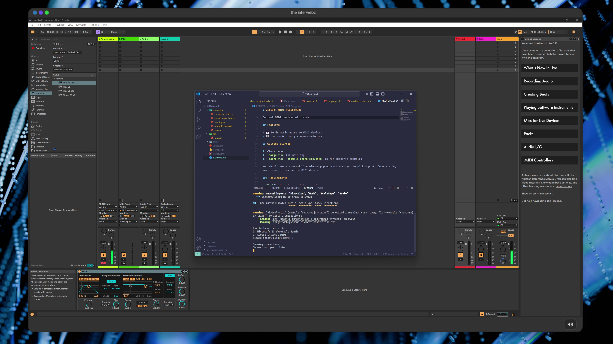

# Virtual MIDI Playground

Control MIDI devices with code.

## Features

- 🎹 Sends music notes to MIDI devices
- 🎼 Use music theory compose melodies

## Getting Started

1. Clone repo
1. `cargo run` for main app
1. `cargo run --example chord-eleventh` to run specific examples

You should see a command line window pop up that asks you to pick a port. Once you do, music should play on the MIDI device.

### Requirements

- [Rust](https://www.rust-lang.org/)
- An app to listen to the MIDI output (like Ableton Live) or you could code your own using the Web MIDI API - or any native equivalent.

## Virtual MIDI

### Windows

For Windows, to create a virtual MIDI port you'll need special device access.

I recommend using a free (for personal use) app called [LoopBe1](https://www.nerds.de/en/loopbe1.html). Install it and you should see it appear in the list of available outputs when you run the Rust code as "LoopBe Internal MIDI".

## Tips

### Ableton Live

As long as your track (the tall column labeled MIDI on top) is set to "All Ins" for the "MIDI From", you should hear playback when running the code.

If you've created a virtual MIDI device, it should appear in the output dropdown of the monitor in the MIDI track if you want to isolate it.
